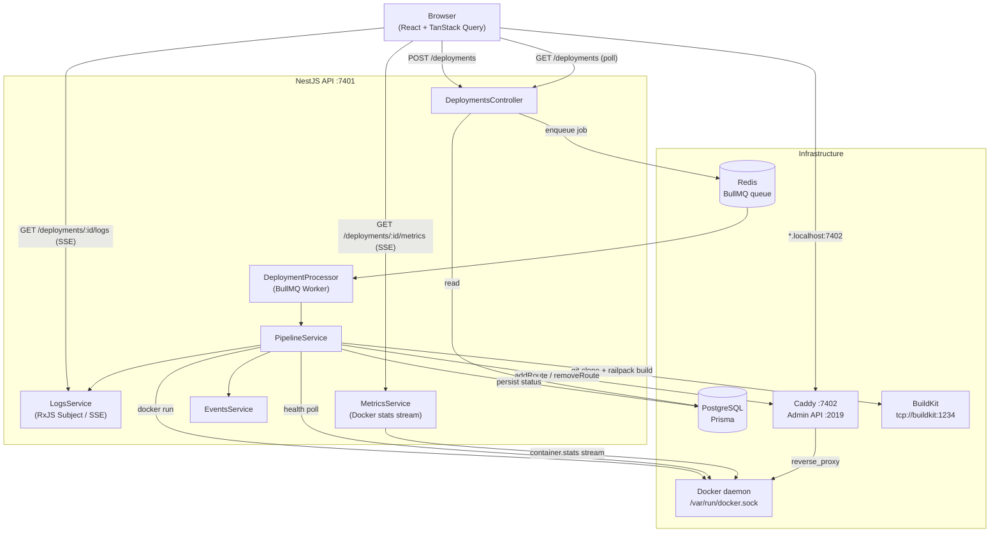
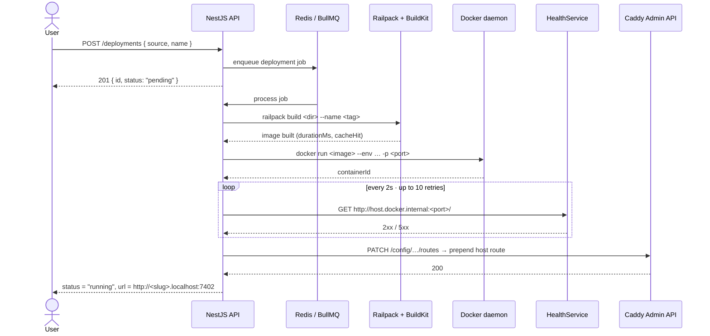
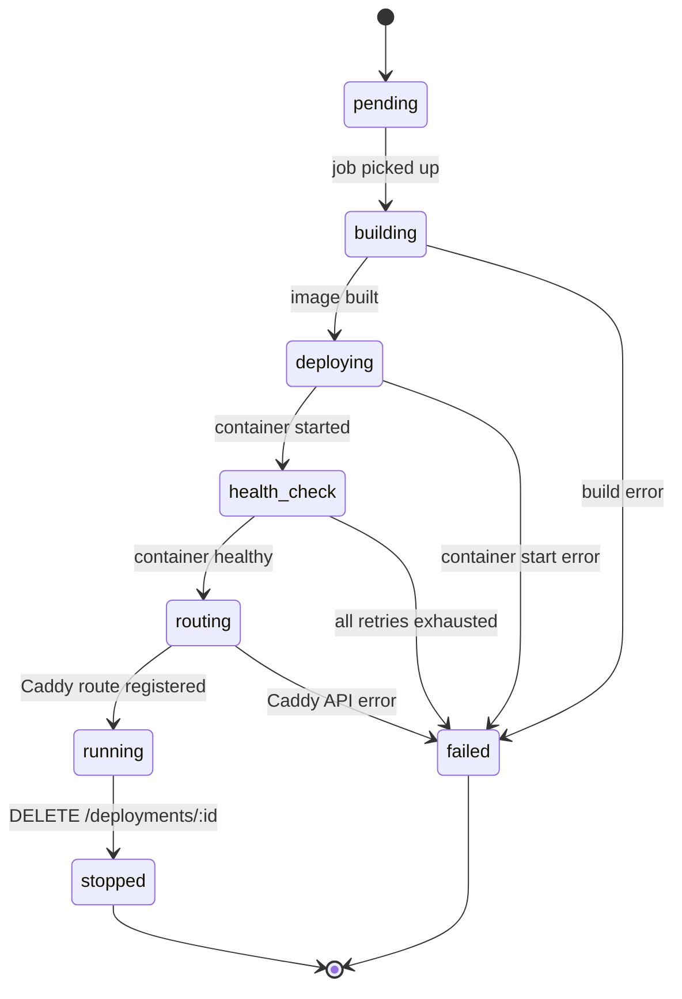
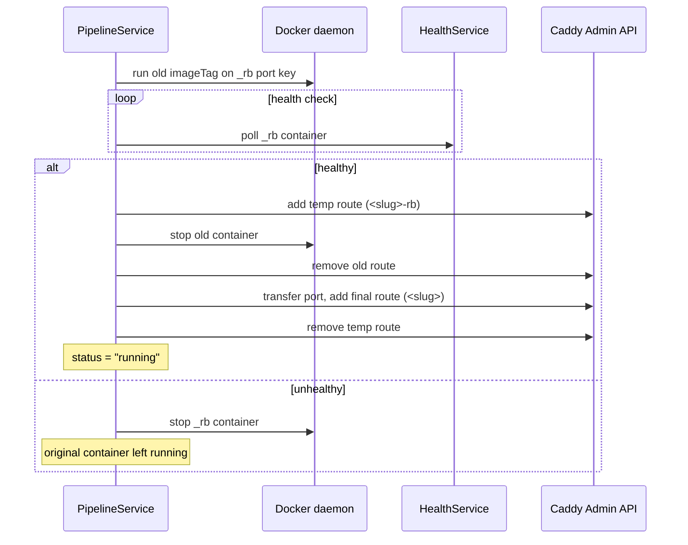

# brimble-pipeline

A mini-PaaS deployment pipeline. Users submit a Git URL or upload a project.
The system builds it into a Docker image using Railpack, runs it as a container,
and Caddy reverse-proxies a subdomain URL to it. Logs stream live to the UI over SSE.

## Demo

[](https://youtu.be/O7J07BKyfus)

## Architecture



## Deployment flow



## Status lifecycle



## Rollback flow



## Why BullMQ over raw async

Raw `fire-and-forget` (`this.pipeline.run().catch(...)`) silently drops jobs on API restart.
BullMQ persists jobs in Redis so an in-flight deployment survives a container restart.
It also gives retry configuration, dead-letter queues, and a Bull Board UI for free.

## Why health checks before route registration

Registering a Caddy route before the container is ready causes a window where users
hit 502s. The health poller (10 × 2 s) waits for any non-5xx response before telling
Caddy to route traffic, eliminating that window.

## Why port allocator in DB vs random ports

Random ports (original approach) have a birthday-problem collision risk that grows
quadratically: with ~300 deployments you have a >1% chance of a collision per launch.
The DB allocator does a single `INSERT … UNIQUE` per port — any race is caught by the
unique constraint and retried immediately. No coordinator needed.

## Container resource limits

Each container is capped at 512 MB RAM (swap disabled), 50% of one CPU core.
Without limits a single misbehaving app can OOM the host or starve other containers.
`RestartPolicy: no` means the pipeline — not Docker — controls the container lifecycle,
so a crash doesn't silently spin up a new container that bypasses health checks.

## Running locally

```bash
git clone https://github.com/blockchainBard101/brimble-pipeline
cd brimble-pipeline
docker compose up --build
# Dashboard:    http://localhost:7400
# API:          http://localhost:7401
# Deployed apps http://<slug>.localhost:7402
```

No `.env` file needed — all defaults are baked into `docker-compose.yml`.

To apply DB migrations inside the running stack:

```bash
docker compose exec api npx prisma migrate deploy
```

## Build Cache

Railpack uses BuildKit-compatible local caching. Each deployment's cache is keyed by its
deployment ID and stored in the `railpack_cache` Docker volume mounted at `/cache` inside
the API container.

| Build type | Typical duration |
|---|---|
| Cold (first build) | 1–3 min (downloads layers, installs deps) |
| Warm (cached) | 10–40 s (skips already-built stages) |

`cacheHit` is determined by whether `/cache/<deploymentId>` exists **before** the build starts.
Build duration is stored on the `Build` model as `durationMs` and shown in the UI.

## Container Metrics

After a deployment reaches `running` status, MetricsService opens a persistent Docker stats
stream (`container.stats({ stream: true })`) and fans metrics out to any connected SSE clients.

**CPU formula (exact Docker formula):**

```
cpuDelta    = cpu_stats.cpu_usage.total_usage - precpu_stats.cpu_usage.total_usage
systemDelta = cpu_stats.system_cpu_usage      - precpu_stats.system_cpu_usage
cpuPercent  = (cpuDelta / systemDelta) * numCpus * 100
```

Docker reports **cumulative** nanosecond counters; the delta between two consecutive stat frames
gives the per-interval usage. One `Subject<ContainerMetrics>` per deployment is shared across
all SSE subscribers.

## Subdomain Routing

Each deployment gets a URL of the form `http://<name>-<shortId>.localhost:7402`.

**How `*.localhost` resolves:**
- Chrome and Firefox resolve `*.localhost` to `127.0.0.1` natively (RFC 6761).
- Safari does not — add manually: `echo "127.0.0.1 <slug>.localhost" | sudo tee -a /etc/hosts`

**Caddy route registration:**
- On startup, `PipelineService.onModuleInit()` re-registers all `status=running` deployments,
  so routes survive Caddy or API restarts.
- New routes are **prepended** before the catch-all using `PATCH /config/…/routes` so host
  matchers win. Existing routes are updated in-place via `PUT /id/<routeId>`.

## GitHub Webhooks

Wire up auto-deploy on push in three steps:

1. Set `GITHUB_WEBHOOK_SECRET=<random>` in your API env.
2. In your GitHub repo: Settings → Webhooks → Add webhook.
   - Payload URL: `http://<your-server>:7401/webhooks/github`
   - Content type: `application/json`
   - Secret: same value as `GITHUB_WEBHOOK_SECRET`
   - Events: **Just the push event**
3. Push to the default branch — the API finds any existing deployment for that repo URL and
   triggers a redeploy. If none exists, it creates a new deployment automatically.

**HMAC verification:** every incoming webhook is verified with `crypto.timingSafeEqual` against
the `X-Hub-Signature-256` header before any processing. Invalid signatures return 401.

## Production Delta

| This implementation | Production equivalent |
|---|---|
| `dockerode` + Docker socket | Nomad job submission via Nomad HTTP API |
| Caddy Admin API (dynamic routes) | Consul service registration + Consul-Template regenerating Caddy config |
| BullMQ + Redis | Nomad's built-in job scheduler |
| DB `PortAllocation` table | Nomad dynamic port allocation in job spec |
| `/var/run/docker.sock` | Nomad client API endpoint |
| `.env` secrets | Vault dynamic secrets injected at job runtime |
| Single-node Caddy | Multi-region Caddy fleet behind anycast |

## What I'd do with more time

- **Nomad instead of raw Docker** — mirrors Brimble's actual production stack; gives
  scheduling, health-check integration, and drain semantics for free.
- **Consul for service discovery** — instead of hardcoding `host.docker.internal` in
  Caddy upstreams, Consul provides dynamic upstream registration with TTL health checks.
- **Vault for secrets** — env vars in docker-compose are fine for dev; production needs
  dynamic secret injection and rotation, especially for DB credentials.
- **S3/R2 for build artifact storage** — currently image tags are local to the host;
  distributing builds across nodes requires a registry (push to ECR, pull on any node).
- **Subdomain routing per deployment** — `<id>.brimble.dev` instead of `.localhost`
  requires wildcard DNS and a TLS cert, but gives customers a shareable URL instantly.
- **Bull Board** — mount `@bull-board/api` at `/admin/queues` for a visual job inspector.

## What I'd rip out

- The `_rb` key hack in rollback — a proper `containers` table that decouples containers
  from deployments 1:1 would eliminate the synthetic port-key gymnastics.
- `LogsService.streams` Map — for multi-instance deployments this is per-process memory.
  Replace with a Redis pub/sub channel per deploymentId so any API instance can fan out SSE.

## Known limitations

- **Single host only** — Docker socket is mounted directly; no multi-node scheduling.
- **No image registry** — images built by Railpack exist only on the Docker daemon that
  built them. Rollback only works if the daemon hasn't pruned the image.
- **SSE fan-out is in-process** — horizontal scaling of the API breaks log streaming
  unless backed by Redis pub/sub (see above).
- **No auth** — all endpoints are public. Production needs at minimum a bearer token on
  the API and Caddy admin interface bound to a private network only.


## Time Spent

| Phase | What | Hours |
|---|---|---|
| Phase 1 | Core scaffold, pipeline, Railpack + Docker + Caddy integration, SSE log streaming | 8h |
| Phase 2 | BullMQ queue, port allocator, health checks, graceful shutdown, resource limits, rollback | 6h |
| Phase 3 | Build cache, container metrics, subdomain routing, GitHub webhooks, activity feed, env vars encryption | 8h |
| Frontend | shadcn/ui redesign, Railway-inspired dark theme, all components | 4h |
| README + diagrams | Architecture diagrams, decision writeups, production delta | 2h |
| **Total** | | **~29h** |

## Brimble Deploy + Feedback

**Deployed app:** https://react-null.brimble.app/

Deployed a React app on Brimble as part of this take-home submission.
Here's the honest version:

The good: onboarding flow is clean and the UI is genuinely well designed.
Connecting a GitHub repo, selecting a branch, and triggering a deploy took
under 2 minutes. Build logs appeared inline during the build which was great, exactly the experience I was trying to replicate in my own submission.

The friction:

First I tried deploying my Next.js portfolio. Got a prompt to upgrade my plan
to deploy "web services"  but a Next.js app is a frontend framework, not a
web service. The distinction isn't clear from the UI and the error messaging
doesn't explain what specifically about Next.js requires an upgrade. I expected
Brimble to handle Next.js out of the box given it's the most popular React
framework. That was a jarring first experience.

Second attempt was a plain JavaScript frontend, same result. Failed build,
same upgrade prompt. At this point I wasn't sure if the issue was the framework,
the plan tier, or something in my project config. No actionable error message
to tell me which.

Third attempt — a plain React app (Vite). This worked cleanly. Railpack detected
the framework automatically, build succeeded, URL was live in under 2 minutes.

What I'd change:

- The plan gate needs better messaging. "Upgrade to deploy web services" means
  nothing to a developer. Say specifically: "Next.js SSR requires a paid plan
  because it needs a Node.js runtime — static React apps deploy free."

- Failed builds should show exactly why they failed, not just a generic error.
  I had to guess whether it was a framework issue, a config issue, or a plan
  issue. That ambiguity kills trust fast.

- The free tier should be clearer upfront about what frameworks are supported.
  A compatibility matrix on the pricing page would eliminate the trial-and-error
  entirely.

One thing that stood out positively: Railpack detecting the Vite + React stack
automatically with zero config is genuinely impressive  and interesting to see
in the wild given I'm using Railpack internally in my own submission to do the
same thing.